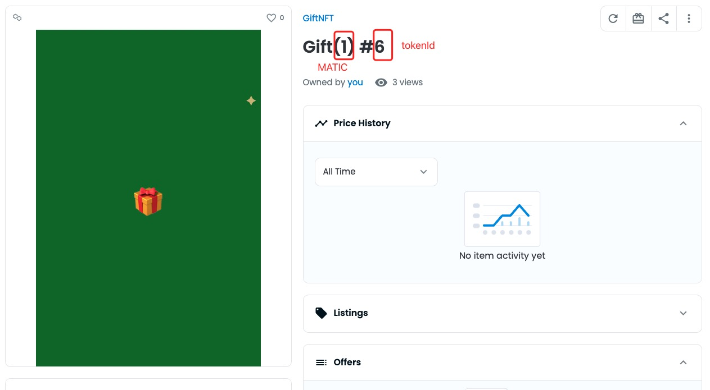
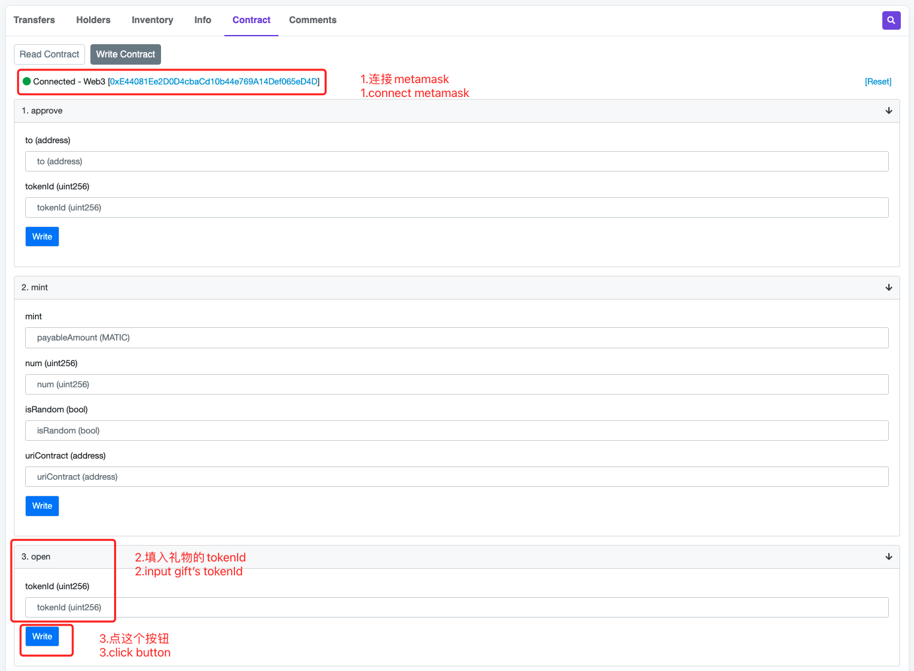

# GiftNFT说明

##### mint的时候把Token放进去，你就得到一个自带Token的礼物NFT，放的Token越多礼物会越大，星星越多，谁打开这个NFT就能获得里面的Token，打开后GiftNFT会自动销毁。
##### 已上线[Polygon](https://polygonscan.com/token/0xaf680053b13c494662b653f4d218b9423cce7902#readContract)，Token暂时只支持Matic，未来会升级。
##### 已支持[OpenSea](https://opensea.io/collection/giftnft-1)。
#
## 来mint个礼物
##### GiftNFT由用户自由mint，免费，没有管理模块（后门），放进去的Token只有NFT拥有者可以取出
##### 打开 https://polygonscan.com/token/0xaf680053b13c494662b653f4d218b9423cce7902#writeContract
 

  

### mint参数详解
##### mint: 放入的MATIC总额，填10，就是放10个MATIC
##### num: 一共mint多少个红包，如果放10个MATIC，num填2，那么每个红包就有2个MATIC
##### isRamdon: false表示每个红包的MATIC是平均的，true表示每个红包的金额是随机的
##### uriContract: 指定红包的样式，可以用这个0xeeC3A34BdeE6Fc9E635aB70956D69AebA15D953C，这个是🎁的样式
 

##### mint后在OpenSea就可以看到了 https://opensea.io/collection/giftnft-1
#
## 打开礼物
##### 在OpenSea 查看你的GiftNFT，比如 https://opensea.io/assets/matic/0xaf680053b13c494662b653f4d218b9423cce7902/6
 

 

##### 其中Gift(1) #6，1表示这个红包有1个MATIC，6表示这个红包的tokenId是6
##### 打开 https://polygonscan.com/token/0xaf680053b13c494662b653f4d218b9423cce7902#writeContract
 

 

##### GiftNFT内的MATIC就会打到你钱包了，并且GiftNFT会自动销毁
#
##### 该项目只开发了一天，难免有些粗糙，如有疑问可以联系 bitcoinjxr@gmail.com