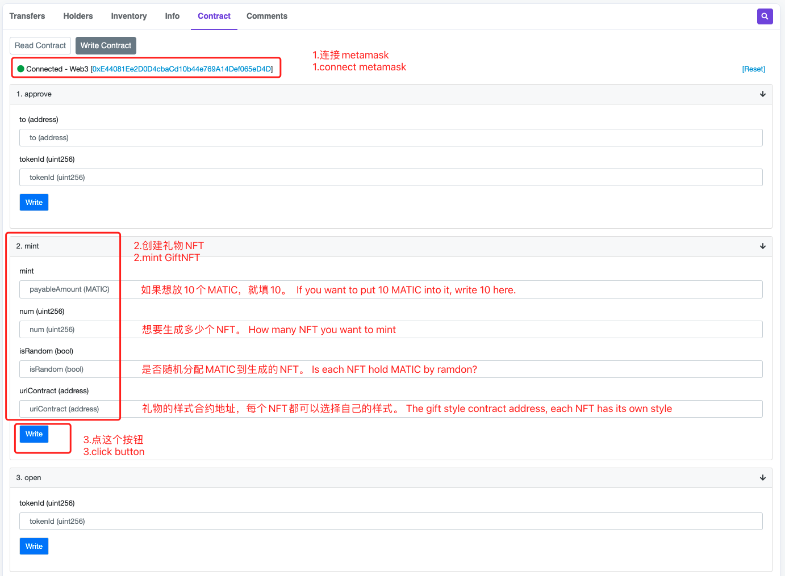

# GiftNFT说明

### mint的时候把Token放进去，你就得到一个自带Token的礼物NFT，放的Token越多礼物会越大，星星越多，谁打开这个NFT就能获得里面的Token，打开后GiftNFT会自动销毁。
### 已上线[Polygon](https://polygonscan.com/token/0xaf680053b13c494662b653f4d218b9423cce7902#readContract)，Token暂时只支持Matic，未来会升级。
### 已支持[OpenSea](https://opensea.io/collection/giftnft-1)。

## 来mint个礼物
### GiftNFT由用户自由mint，免费，没有管理模块（后门），放进去的Token只有NFT拥有者可以取出

uriContract: 0xeeC3A34BdeE6Fc9E635aB70956D69AebA15D953C

